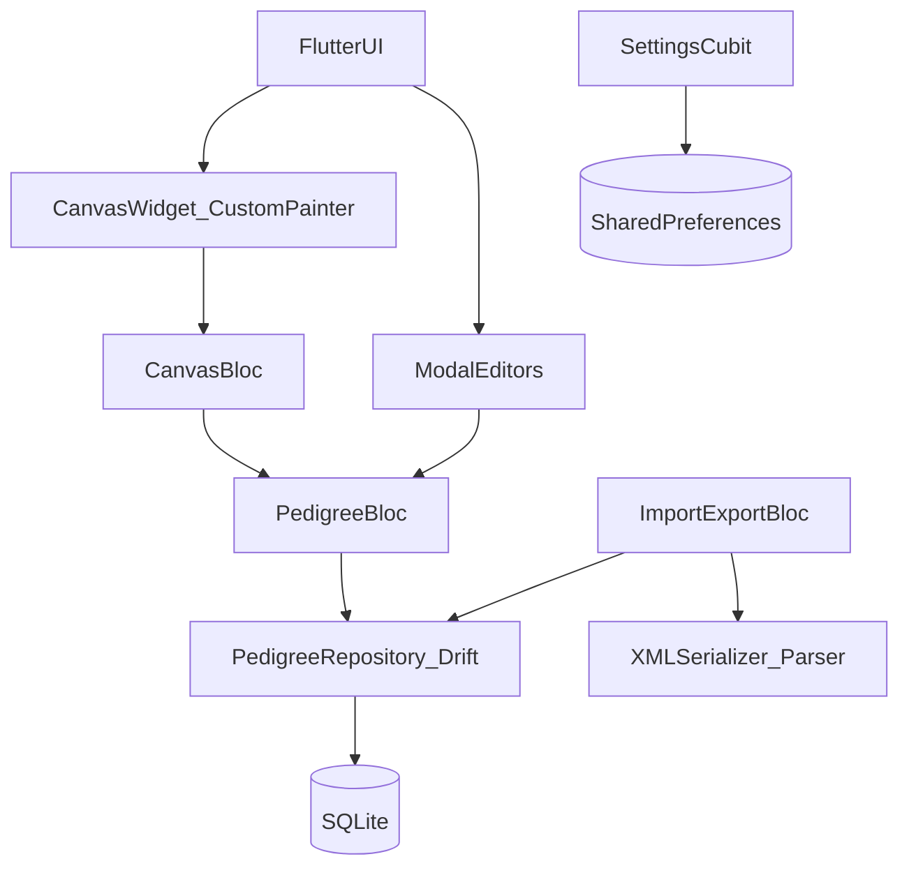
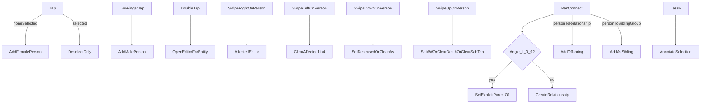

# Proband Flutter Rewrite Specification (repo-based, fail‑proof)

## Scope (fixed)
- **Target platforms**: iOS + Android
- **State management**: `flutter_bloc`
- **Local database**: **SQLite via Drift**
- **Canvas rendering**: `CustomPainter` + gesture handling (tap, double tap, two-finger tap, swipe, pan, long-press, lasso)
- **Networking**: none required (no remote APIs found in repo; import/export is file-based)

## Source of truth (this repo)
- **Core data model**: `Proband/Model.xcdatamodeld/Model.xcdatamodel/contents`
- **Import/export XML contract**: `Proband/PedigreeImporter.m`, `Proband/PedigreeExporter.m`
- **Canvas gestures**: `Proband/FamilyView.m`
- **Editing/controller logic**: `Proband/FamilyViewController.m`, `Proband/MainViewController.m`
- **Rendering rules**: `Proband/PersonView.m`, `Proband/RelationshipView.m`, `Proband/SiblingGroupView.m`, `Proband/DonorGroupView.m`, `Proband/SurrogateGroupView.m`
- **Domain logic**: `Proband/Person.m`, `Proband/Relationship.m`, `Proband/PedigreeRules.m`, `Proband/PedigreeIntegrityScanner.m`
- **Ontology lookup**: `Proband/OntologySearch.m` (+ bundled `Proband/terms.sqlite`)
- **Settings keys**: `Proband/SettingsViewController.h`
- **App boot + drawer**: `Proband/AppDelegate.m`

---

## Data model (Drift / SQLite)

### Design principles
- **Mirror semantics, not Core Data implementation details**: the Flutter app must reproduce behavior, export/import compatibility, and drawing outcomes.
- **Stable internal IDs**: use integer PKs in SQLite; do **not** reuse XML `managedObjectID` as a DB key (it is an export-time reference map).
- **Relationships represented explicitly**: Core Data uses to-many relationships; in SQLite we model them with join tables where needed.
- **Invariants enforced in code + DB**:
  - Relationship must have **exactly 2 members**.
  - Pregnancy and NLets must have **≥2 members**.
  - A person’s `descendancy_relationship_id` may be null or reference a relationship; if set, the person is a descendant of that relationship.

### Tables (authoritative)
Below is the minimum required schema to reproduce the current app. Column names are chosen to be explicit and Drift-friendly.

#### `pedigrees`
- `id` INTEGER PK
- `created_at` INTEGER (unix ms) (optional but recommended)

#### `meta`
One row per pedigree.
- `id` INTEGER PK
- `pedigree_id` INTEGER UNIQUE NOT NULL REFERENCES `pedigrees(id)` ON DELETE CASCADE
- `name` TEXT NOT NULL DEFAULT `'Unnamed'`
- `notes` TEXT NULL
- `version` TEXT NULL
- `moons` INTEGER NOT NULL DEFAULT 0 (maps Core Data boolean-ish stored number)
- `next_id` INTEGER NOT NULL DEFAULT 1 (Core Data `Integer 16`)
- `affected1_diagnosis_id` INTEGER NULL REFERENCES `diagnoses(id)` ON DELETE SET NULL
- `affected2_diagnosis_id` INTEGER NULL REFERENCES `diagnoses(id)` ON DELETE SET NULL
- `affected3_diagnosis_id` INTEGER NULL REFERENCES `diagnoses(id)` ON DELETE SET NULL
- `affected4_diagnosis_id` INTEGER NULL REFERENCES `diagnoses(id)` ON DELETE SET NULL

**Notes**
- In the iOS app, `Meta.affected1..4` are `Diagnosis` objects not necessarily tied to a person (used as the “key” labels). This is why the FK points into `diagnoses` with `person_id` allowed to be NULL.

#### `people`
One row per person symbol.
- `id` INTEGER PK
- `pedigree_id` INTEGER NOT NULL REFERENCES `pedigrees(id)` ON DELETE CASCADE
- `node_id` INTEGER NOT NULL DEFAULT 0 (print footnote ID, assigned during print/export flow)
- `center_x` REAL NOT NULL DEFAULT 0
- `center_y` REAL NOT NULL DEFAULT 0
- `sex` TEXT NULL  (expected values: `'M'|'F'|'U'`)
- `quantity` TEXT NOT NULL DEFAULT `'1'` (string in Core Data; UI treats numeric)

**Clinical/demographic fields**
- `age` TEXT NULL
- `age_units` TEXT NULL (expected `'Y'|'M'|'W'`)
- `height` TEXT NULL
- `gest_age` TEXT NULL
- `note` TEXT NULL

**Flags**
- `proband` INTEGER NOT NULL DEFAULT 0
- `deceased` INTEGER NOT NULL DEFAULT 0
- `aw` INTEGER NOT NULL DEFAULT 0 (alive + well)
- `still_birth` INTEGER NOT NULL DEFAULT 0
- `sab` INTEGER NOT NULL DEFAULT 0
- `top` INTEGER NOT NULL DEFAULT 0
- `p` INTEGER NOT NULL DEFAULT 0
- `donor` INTEGER NOT NULL DEFAULT 0
- `surrogate` INTEGER NOT NULL DEFAULT 0
- `adopted_in` INTEGER NOT NULL DEFAULT 0
- `adopted_out` INTEGER NOT NULL DEFAULT 0
- `no_children_by_choice` INTEGER NOT NULL DEFAULT 0
- `no_children_infertility` INTEGER NOT NULL DEFAULT 0
- `infertility_reason` TEXT NULL
- `carried_by_surrogate` INTEGER NOT NULL DEFAULT 0

**Cause-of-death fields**
- `age_at_death` TEXT NULL
- `age_at_death_units` TEXT NULL (expected `'Y'|'M'|'W'`)
- `cause_of_death` TEXT NULL
- `cause_of_death_ontology` TEXT NULL (`'HPO'|'ICD'` in current UI)
- `cause_of_death_ontology_id` TEXT NULL
- `cause_of_death_ontology_version` TEXT NULL

**Affected quadrants + Dx-age**
- `affected1` INTEGER NOT NULL DEFAULT 0
- `affected2` INTEGER NOT NULL DEFAULT 0
- `affected3` INTEGER NOT NULL DEFAULT 0
- `affected4` INTEGER NOT NULL DEFAULT 0
- `affected1_dx_age` REAL NULL
- `affected2_dx_age` REAL NULL
- `affected3_dx_age` REAL NULL
- `affected4_dx_age` REAL NULL
- `affected1_dx_age_units` TEXT NOT NULL DEFAULT `'Y'`
- `affected2_dx_age_units` TEXT NOT NULL DEFAULT `'Y'`
- `affected3_dx_age_units` TEXT NOT NULL DEFAULT `'Y'`
- `affected4_dx_age_units` TEXT NOT NULL DEFAULT `'Y'`

**Parentage & assisted reproduction links (all self-referential FKs)**
- `descendancy_relationship_id` INTEGER NULL REFERENCES `relationships(id)` ON DELETE SET NULL
- `explicit_bio_mother_id` INTEGER NULL REFERENCES `people(id)` ON DELETE SET NULL
- `explicit_bio_father_id` INTEGER NULL REFERENCES `people(id)` ON DELETE SET NULL
- `egg_donor_id` INTEGER NULL REFERENCES `people(id)` ON DELETE SET NULL
- `sperm_donor_id` INTEGER NULL REFERENCES `people(id)` ON DELETE SET NULL
- `carried_by_id` INTEGER NULL REFERENCES `people(id)` ON DELETE SET NULL

**Group membership**
- `pregnancy_id` INTEGER NULL REFERENCES `pregnancies(id)` ON DELETE SET NULL
- `nlets_id` INTEGER NULL REFERENCES `nlets(id)` ON DELETE SET NULL

#### `relationships`
Relationship line connecting exactly two members.
- `id` INTEGER PK
- `pedigree_id` INTEGER NOT NULL REFERENCES `pedigrees(id)` ON DELETE CASCADE
- `active` INTEGER NOT NULL DEFAULT 1
- `consanguinous` INTEGER NOT NULL DEFAULT 0
- `consanguinity_degree` TEXT NULL
- `no_children_by_choice` INTEGER NOT NULL DEFAULT 0
- `no_children_infertility` INTEGER NOT NULL DEFAULT 0

#### `relationship_members`
Join table, enforcing exactly 2 members per relationship via application invariant.
- `relationship_id` INTEGER NOT NULL REFERENCES `relationships(id)` ON DELETE CASCADE
- `person_id` INTEGER NOT NULL REFERENCES `people(id)` ON DELETE CASCADE
- `role_index` INTEGER NOT NULL (0/1; preserves stable ordering if needed)
- PRIMARY KEY (`relationship_id`, `person_id`)
- UNIQUE (`relationship_id`, `role_index`)

#### `relationship_descendants`
Join table: children connected to relationship line.
- `relationship_id` INTEGER NOT NULL REFERENCES `relationships(id)` ON DELETE CASCADE
- `person_id` INTEGER NOT NULL REFERENCES `people(id)` ON DELETE CASCADE
- PRIMARY KEY (`relationship_id`, `person_id`)

**Note**: Core Data stores `Person.descendancy` as a to-one relationship and also stores `Relationship.descendants` to-many. Keep both in sync in Flutter by writing both sides in a transaction.

#### `diagnoses`
Represents both per-person diagnoses and meta “key” diagnoses.
- `id` INTEGER PK
- `person_id` INTEGER NULL REFERENCES `people(id)` ON DELETE CASCADE
- `name` TEXT NULL
- `ontology` TEXT NULL
- `ontology_version` TEXT NULL
- `ontology_id` TEXT NULL  (Core Data attribute name is `id`)
- `order_index` INTEGER NOT NULL DEFAULT 0
- `age_at_dx` REAL NULL
- `age_at_dx_units` TEXT NOT NULL DEFAULT `'Y'`
- `carrier` INTEGER NOT NULL DEFAULT 0
- `cause_of_death` INTEGER NOT NULL DEFAULT 0
- `mode_of_inheritance` TEXT NULL

#### `annotations`
Positioned free-text; linked to many people and one meta.
- `id` INTEGER PK
- `meta_id` INTEGER NOT NULL REFERENCES `meta(id)` ON DELETE CASCADE
- `center_x` REAL NOT NULL DEFAULT 0
- `center_y` REAL NOT NULL DEFAULT 0
- `text` TEXT NULL

#### `annotation_people`
Many-to-many annotation membership.
- `annotation_id` INTEGER NOT NULL REFERENCES `annotations(id)` ON DELETE CASCADE
- `person_id` INTEGER NOT NULL REFERENCES `people(id)` ON DELETE CASCADE
- PRIMARY KEY (`annotation_id`, `person_id`)

#### `pregnancies`
- `id` INTEGER PK
- `date_ms` INTEGER NULL

#### `pregnancy_members`
- `pregnancy_id` INTEGER NOT NULL REFERENCES `pregnancies(id)` ON DELETE CASCADE
- `person_id` INTEGER NOT NULL REFERENCES `people(id)` ON DELETE CASCADE
- PRIMARY KEY (`pregnancy_id`, `person_id`)

#### `nlets`
- `id` INTEGER PK

#### `nlets_members`
- `nlets_id` INTEGER NOT NULL REFERENCES `nlets(id)` ON DELETE CASCADE
- `person_id` INTEGER NOT NULL REFERENCES `people(id)` ON DELETE CASCADE
- PRIMARY KEY (`nlets_id`, `person_id`)

### Required indexes
- `people(pedigree_id)`
- `relationships(pedigree_id)`
- `diagnoses(person_id, order_index)`
- `relationship_members(person_id)`
- `relationship_descendants(person_id)`
- `annotation_people(person_id)`

### Persistence behavior mapping (Core Data → SQLite)
- Core Data file: `Documents/pedigrees/store.data` and export archive copy to `Documents/export/archive.sqlite` (`Proband/DataStore.m`, `Proband/MainViewController.m`).
- Flutter must support:
  - **Multiple pedigrees** stored in one DB.
  - **Export current pedigree** to XML, PNG, PDF equivalents (Flutter will need platform sharing).
  - **Export archive**: a single SQLite file copy of the DB (same concept as the iOS “archive.sqlite”).

---

## XML import/export compatibility (must match)

### Version gating
Importer rejects pedigrees whose `_version` major is greater than current major (`Proband/PedigreeImporter.m` uses `EDSemver` + iVersion).
- **Flutter requirement**: implement SemVer parsing and enforce:
  - If XML contains `_version`, and `src.major > current.major` → **reject import**.
  - Otherwise proceed.

### Reference scheme (“managedObjectID”)
Exporter assigns a sequential external ID per exported object and serializes cross-links as `{"_ref":"<id>"}`.
- People/relationships/annotations/pregnancies/nlets include `managedObjectID`.
- Nested references use `_ref` values.

**Flutter requirement**
- Exporter must produce identical structure:
  - `pedigree` root with `_version = appVersion`.
  - `people/person[]`: full attribute set + references to related objects as in iOS exporter.
  - `relationships/relationship[]`: attributes + `members/person[]` refs.
  - `annotations/annotation[]`: attributes.
  - `pregnancies/pregnancy[]`, `nlets/nlet[]`: each with `members/person[]` refs.
  - `meta`: attributes + embedded `affected1..4` dictionaries (not refs).

### XML shape (canonical)
This is the **shape** produced by `Proband/PedigreeExporter.m` and expected by `Proband/PedigreeImporter.m`.

```xml
<pedigree _version="MAJOR.MINOR.PATCH">
  <meta>
    <name>...</name>
    <notes>...</notes>
    <moons>0|1</moons>
    <nextID>...</nextID>
    <version>...</version>
    <affected1>
      <id>...</id>
      <ontology>HPO|ICD</ontology>
      <ontologyVersion>...</ontologyVersion>
      <name>...</name>
      <!-- other Diagnosis attributes may be present -->
    </affected1>
    <!-- affected2..affected4 similarly -->
  </meta>

  <people>
    <person>
      <!-- all Person attributes (see list below) -->
      <managedObjectID>1</managedObjectID>

      <annotations>
        <annotation _ref="10"/>
        <!-- ... -->
      </annotations>

      <diagnoses>
        <diagnosis>
          <!-- all Diagnosis attributes -->
        </diagnosis>
      </diagnoses>

      <relationships>
        <relationship _ref="20"/>
      </relationships>

      <carried>
        <person _ref="2"/>
      </carried>
      <carriedBy _ref="3"/>
      <descendancy _ref="20"/>

      <donatedEgg>
        <person _ref="4"/>
      </donatedEgg>
      <donatedSperm>
        <person _ref="5"/>
      </donatedSperm>
      <eggDonor _ref="6"/>
      <spermDonor _ref="7"/>

      <explicitlySetBiologicalMother _ref="8"/>
      <explicitlySetBiologicalFather _ref="9"/>

      <pregnancy _ref="30"/>
      <nlet _ref="40"/>
    </person>
    <!-- ... -->
  </people>

  <relationships>
    <relationship>
      <!-- Relationship attributes -->
      <managedObjectID>20</managedObjectID>
      <members>
        <person _ref="1"/>
        <person _ref="2"/>
      </members>
    </relationship>
  </relationships>

  <annotations>
    <annotation>
      <managedObjectID>10</managedObjectID>
      <centerX>...</centerX>
      <centerY>...</centerY>
      <text>...</text>
    </annotation>
  </annotations>

  <pregnancies>
    <pregnancy>
      <managedObjectID>30</managedObjectID>
      <date>...</date>
      <members>
        <person _ref="1"/>
        <person _ref="2"/>
      </members>
    </pregnancy>
  </pregnancies>

  <nlets>
    <nlet>
      <managedObjectID>40</managedObjectID>
      <members>
        <person _ref="1"/>
        <person _ref="2"/>
      </members>
    </nlet>
  </nlets>
</pedigree>
```

### Exported attribute lists (must match, including empty strings)
The exporter uses `dictionaryWithValuesForKeys:entity.attributesByName.allKeys` and then replaces nulls with empty strings, so Flutter must:
- **Export every attribute key** listed below.
- If a value is null, **export an empty string** (not omitting the key).

**Person attributes** (from `Model.xcdatamodel`):
- `adoptedIn`, `adoptedOut`, `affected1`, `affected1DxAge`, `affected1DxAgeUnits`, `affected2`, `affected2DxAge`, `affected2DxAgeUnits`, `affected3`, `affected3DxAge`, `affected3DxAgeUnits`, `affected4`, `affected4DxAge`, `affected4DxAgeUnits`
- `age`, `ageAtDeath`, `ageAtDeathUnits`, `ageUnits`, `aw`, `carriedBySurrogate`
- `causeOfDeath`, `causeOfDeathOntology`, `causeOfDeathOntologyId`, `causeOfDeathOntologyVersion`
- `centerX`, `centerY`, `deceased`, `donor`, `gestAge`, `height`
- `infertilityReason`, `noChildrenByChoice`, `noChildrenInfertility`
- `nodeID`, `note`, `p`, `proband`, `quantity`, `sab`, `sex`, `stillBirth`, `surrogate`, `top`

**Relationship attributes**:
- `active`, `consanguinityDegree`, `consanguinous`, `noChildrenByChoice`, `noChildrenInfertility`

**Diagnosis attributes**:
- `ageAtDx`, `ageAtDxUnits`, `carrier`, `causeOfDeath`, `id`, `modeOfInheritance`, `name`, `ontology`, `ontologyVersion`, `order`

**Annotation attributes**:
- `centerX`, `centerY`, `text`

**Pregnancy attributes**:
- `date`

**Meta attributes**:
- `moons`, `name`, `nextID`, `notes`, `version`

### Import algorithm (two-pass, fail-safe)
Importer flow (`Proband/PedigreeImporter.m`):
1. Parse XML to dictionary.
2. Create new pedigree and meta.
3. Create all `Person` records (first pass), storing `managedObjectID -> Person` in a map.
4. Create relationships (using member refs).
5. Create annotations, pregnancies, nlets.
6. Second pass over people:
   - Attach annotation refs to people.
   - Set `descendancy`, explicit parents, egg/sperm donors, carriedBy.
7. Save.

**Flutter requirement**
- Use an in-memory map `xmlId -> localDbPersonId` during import.
- Wrap import in a single transaction.
- Apply locale decimal fix used by importer (`fixLocale`) for centerX/centerY:
  - Replace `.` or `,` with the current locale decimal separator before numeric parsing.
  - In Flutter, prefer parsing with a tolerant strategy: accept both `.` and `,` as decimal separators.

### Conformance tests (required)
Create a test suite that round-trips and validates:
- **Import sample**: iOS-exported `.pbxml` imports successfully and produces:
  - same counts: people, relationships, annotations, pregnancies, nlets
  - same per-person fields (including booleans and strings)
  - same graph connectivity (members, descendants, explicit parent links, donor/surrogate links)
- **Export sample**: Flutter-exported `.pbxml` imports into the legacy iOS importer without errors (major version compatible).

---

## Domain invariants & business rules (must reproduce)

### Relationship creation constraints
From `Proband/PedigreeRules.m`:
- Disallow relationship if:
  - `a` already has relationship with `b`
  - either has `sab == true`, `top == true`, or `stillBirth == true`

### Offspring constraints
From `Relationship.addOffSpring` and `FamilyViewController.offspringView:of:`:
- A child cannot descend from a relationship they are a member of.
- A child cannot be made offspring of a relationship if the child is a sibling of either relationship member (must detach first).
- Adding offspring clears child’s explicit bio parents and updates relationship no-children flags to false.
- If child has a pregnancy group (twins), apply to all pregnancy members.

### Person graph logic (critical)
From `Proband/Person.m`:
- `parents()` derives connected parents from `descendancy` or single explicit parent.
- `siblings()` is drawing-oriented, includes adopted/assisted-repro edge cases; must match behavior because it controls sibling group rendering.
- Twin logic:
  - `pregnancy` groups all twins/fraternal.
  - `nlets` groups identical twins.
- Biological mother/father resolution:
  - prefer explicit egg/sperm donor if set
  - else explicit bio parent if set
  - else use `descendancy` mother/father if non-same-sex; otherwise nil
  - identical twins can “inherit” donor/explicit parent for biological parent resolution

### Integrity normalization
From `Proband/PedigreeIntegrityScanner.m` (called after undo changes in `MainViewController`):
- If `deceased == true` and `ageAtDeath` missing but `age` present → move `age` to `ageAtDeath` and copy units.
- If `deceased == false` and `age` missing but `ageAtDeath` present → move `ageAtDeath` to `age` and clear `ageAtDeath`.
- If `deceased == false` and `ageAtDeath` present → clear `ageAtDeath`.

**Flutter requirement**
- Run an equivalent integrity pass after:
  - undo/redo
  - any deceased toggle
  - import

---

## UI + Navigation mapping (Flutter)

### Screen inventory (equivalents)
From controllers in repo:
- **Main canvas screen** (`MainViewController` + `FamilyViewController` + `FamilyView`)
  - toolbar: file (new/open/template/save-as), export (pdf/png/pbxml/archive), undo/redo, delete, detach, align, help, settings/drawer
- **Right drawer options** (`OptionsViewController`)
  - edit pedigree note
  - edit “Affected key” diagnoses 1..4 with ontology autocomplete
- **Open/manage pedigrees** (`OpenPedigreeViewController`)
- **Settings** (`SettingsViewController`)
  - show/hide key, footnotes, note, affected diagnoses; footnote style; multiple probands; note template
- **About** (`AboutViewController`)
- **Tutorial** (`TutorialViewController`)
- **Person editors (popover/tabbed in iOS)**:
  - main attributes (`AttributeViewController`)
  - affected details (`AffectedViewController`)
  - deceased details (`DeceasedDetailsViewController`)
  - diagnoses list/editor (`DiagnosesViewController` etc.)
  - relationship attributes (`RelationshipAttributeViewController`)
  - annotations editor (`AnnotationViewController`)

### Flutter navigation recommendation (deterministic)
- Use a single `Navigator` stack + modal sheets/dialogs:
  - `MainCanvasRoute`
  - `PedigreeManagerRoute` (full screen)
  - `SettingsRoute` (full screen)
  - `AboutRoute`, `TutorialRoute`
  - `PersonEditorSheet`, `RelationshipEditorSheet`, `AnnotationEditorSheet`, `AffectedEditorSheet`, `DeceasedEditorSheet`, `DiagnosesEditorSheet`
- Replace the right-side drawer with `Scaffold.endDrawer` (or a dedicated “Options” route if a drawer is not desired on phones).

### App lifecycle + entrypoints (must match behavior)
From `Proband/AppDelegate.m` and `Proband/MainViewController.m`:
- **DB init gate**: UI is shown immediately but actions depending on persistence must wait until DB is ready (`PBCoreDataComplete` in iOS).
  - Flutter: show a blocking loading overlay until Drift is opened and initial snapshot is loaded.
- **First-run tutorial**: shown once (`hasRunAppOnceKey` in `MainViewController.viewDidLayoutSubviews`).
  - Flutter: store an equivalent boolean in `SharedPreferences` and present `TutorialRoute` once after first layout.
- **Open-in import**:
  - iOS supports importing a `.pbxml` via `openURL` and also via launch options URL.
  - Flutter: implement “share/open with” handling for `.pbxml` (e.g., `receive_sharing_intent` / platform channel) and route it to `ImportExportBloc`.
  - If the app is launched from a file, import must happen only after DB init completes (same as iOS behavior).
- **Background save**:
  - iOS saves on background/terminate if `shouldSave` is true.
  - Flutter: on app lifecycle `paused/inactive`, trigger `PersistRequested` unless an export-archive operation has temporarily closed/reopened the DB (see “archive export” below).
- **Archive export**:
  - iOS closes the Core Data store, copies DB to `export/archive.sqlite`, then reopens and restores the previously-open pedigree.
  - Flutter: implement archive export as:
    - flush pending writes
    - copy the SQLite file(s) used by Drift to a temp location (include -wal/-shm if present)
    - share/export the copied files
    - do not modify the live DB while the copy is taken (use a mutex around export to be safe)

---

## Settings & preferences (must match keys/semantics)
From `Proband/SettingsViewController.h` and `SettingsViewController.m`:
- `HideFootnotesKey = "hideFootnotes"` (boolean)
- `HideKeyKey = "hideKey"` (boolean)
- `FootnoteStyleKey = "footnoteStyle"` (int; affects numbering and pdf layout)
- `HideNoteKey = "hideNote"` (boolean)
- `HideAffectedDxsKey = "hideAffectedDxs"` (boolean)
- `MultipleProbandsKey = "multipleProbands"` (boolean)
- `NoteTemplateKey = "noteTemplate"` (string)
- `LastInstalledVersionKey = "lastInstalledProbandVersion"` (string; used with update prompts in `AppDelegate`)

**Flutter storage**
- Use `shared_preferences` with identical string keys to preserve behavior and simplify migration.

---

## Canvas rendering + hit testing (CustomPainter)

### Coordinate system
- iOS stores `Person.centerX/centerY` in model; views are positioned at those coordinates.
- Many drawing computations apply a vertical offset `PersonOffsetY = 35.0` (`GraphUtils.h`).

**Flutter requirement**
- Treat the DB coordinates as world coordinates in a canvas coordinate space.
- Apply the equivalent offsets in paint/layout calculations.

### Implementation notes (Flutter-specific, required to be deterministic)
- **Pan/zoom**: Use `InteractiveViewer` (or a custom `TransformationController`) to replicate `CTUIScrollView` zooming/panning. All hit testing must transform pointer positions from screen → world coordinates using the current transform.
- **Gesture conflicts** (must be resolved explicitly):
  - Keep **pan-to-connect** separate from **canvas pan**:
    - If the gesture starts on a hit-tested entity (person/relationship/sibling group/drag target), treat it as a connect/move gesture.
    - Otherwise treat it as viewport pan (handled by `InteractiveViewer`).
  - Support **long-press + drag** for move and **long-press on empty** for lasso; ensure long-press cancels active connect gestures.
  - Support swipes without being eaten by pan: replicate iOS behavior where a quick pan with short duration is reinterpreted as swipe (`FamilyView.m` uses `maxGestureTime` = 0.25s). In Flutter, implement this by measuring gesture duration and delta and dispatching a swipe action when it matches the thresholds.
- **Hit testing strategy** (performance-critical):
  - Maintain a lightweight spatial index over people bounding boxes (e.g., grid bucket or quadtree) and perform precise shape hit testing only for nearby candidates.
  - Relationship hit testing: approximate with a widened segment distance test (equivalent to stroking the path) against the current relationship polyline.
  - Sibling-group hit testing: same as relationship but using the computed edge path; include dashed adopted segments.
  - Annotations hit testing: simple rect hit test.

### Person symbol rendering (must match visuals/meaning)
From `PersonView.m`:
- Shapes by `sex`:
  - `'M'`: square
  - `'F'`: circle
  - other/unknown: diamond
  - `sab` or `top`: triangle (with `top` also drawing a diagonal)
- `deceased`: diagonal slash across symbol.
- Adoption (`adoptedIn` or `adoptedOut`): draw outer brackets/box.
- Affected quadrants: up to 4 shaded regions, shape-dependent.
- Carrier: small dot in center; color depends on how many quadrants are filled.
- Center labels: quantity, donor `D`, surrogate `S`, pregnancy `P` (from `p`) in center label area.
- No-children markers: drawn via `NoChildrenView` when `noChildrenByChoice` or `noChildrenInfertility` and person is M/F and not top/sab/stillBirth/p.
- Note icon: shown when person `note` is non-empty and not in print mode.
- Caption text below symbol:
  - Age / death age + cause; height; affected dx names + dx ages; diagnoses list; infertility reason; `A+W`.
  - Caption respects `HideAffectedDxsKey`.

### Relationship line rendering
From `RelationshipView.m`:
- Basic line between two parents, with special overlays:
  - `consanguinous`: draw two parallel lines offset by 5px.
  - `active == false`: draw double vertical “inactive” hash at midpoint.
  - `noChildrenByChoice` / `noChildrenInfertility`: draw a “no children” mark down from midpoint, with 1 or 2 slashes.
- Hit testing uses a stroked copy of the path (width ~40).

### Sibling-group rendering (critical)
From `SiblingGroupView.m`:
- Draws:
  - LOD (line of descent) from parents (relationship midpoint or explicit parent point) to a kinship line.
  - LOK (line of kinship) horizontal line at `sibship` distance above sibling tops.
  - Twin triangles and identical twin bars using `twinsDist`.
  - Adopted-in child segments are dashed (separate segment list).
- Hit testing: stroking of the path with a large width (60).

### Donor/surrogate edges
From `DonorGroupView.m` / `SurrogateGroupView.m`:
- Gray lines from donor/surrogate to each connected child (`donatedEgg/donatedSperm` or `carried`).

### Gesture mapping (must match semantics)
From `FamilyView.m` and `FamilyViewController.m`:
- **Single tap (blank area)**:
  - If nothing selected: add **female** person at tap point (unless too close to another person: distance < 80).
  - If something selected: deselect only.
  - If tap results in no action, show temporary red X.
- **Two-finger tap**:
  - Add **male** person at midpoint if the two taps are within `twoTapThreshold` (150px).
  - Ignore if tapping on an edge (sibling group path hit).
- **Double tap**:
  - Opens editor for tapped item (person/relationship/annotation).
- **Swipes**:
  - On person:
    - right: open affected popover/editor
    - left: clear affected1..4 booleans
    - down: set deceased OR clear `aw` if it was set; shows deceased details editor when setting deceased
    - up: if sab/top then clear those and stillBirth/deceased; else if not deceased set `aw=true`; else clear deceased/stillBirth
  - On relationship line:
    - down: `active=false`
    - up: `active=true`
- **Pan (connect gesture)**:
  - person→person:
    - if near-vertical (angle < `LOKLODRadiansThreshold` = 0.9): treat as **explicit parent-of** link (top becomes parent, bottom becomes child). If child has pregnancy, apply to all.
    - else: create **relationship** (subject to `PedigreeRules.allowRelationshipBetween`).
  - person↔relationship: add as offspring (child of relationship).
  - person↔sibling group: add as sibling to group’s members.
  - drag targets (visible when a donor/surrogate person is selected): drag-drop onto another person to set donor/surrogate links.
- **Long press**:
  - On empty canvas: start lasso.
  - On person/relationship/group: “lift” and move; movement grouped in undo.
- **Lasso**:
  - Draws dashed path; if it encloses people, sets them `lassoed` and shows “Annotate Selection” button; tap button opens annotation editor.

### Print/export bounding box rules (for PDF/PNG export)
From `FamilyViewController.boundingRect` and `MainViewController.drawToPrintableContextWithBegin`:
- Bounding rectangle must include:
  - all people (using their `centerX/centerY`)
  - all annotations (`Annotation.centerX/centerY`)
  - margins: `margin = 100`, `bottomBuffer = 100`
- Optional right-side width extensions:
  - key width (~170) unless `HideKeyKey == true`
  - note width (~250) if meta notes present and `HideNoteKey == false`
- Optional left-side width extension:
  - generations roman numerals if footnote style 0 (see settings)

---

## BLoC architecture (flutter_bloc)

### State boundaries (recommended)

#### `PedigreeBloc`
Owns the active pedigree domain state and persistence coordination.
- **State**
  - `activePedigreeId`
  - `entitiesSnapshot` (people/relationships/annotations/diagnoses/etc. for active pedigree)
  - `canUndo`, `canRedo`
  - `saveStatus` (idle/saving/error)
- **Events (minimum)**
  - `PedigreeOpened(pedigreeId)`
  - `PedigreeCreatedFromTemplate(templatePbxml)`
  - `PedigreeRenamed(name)`
  - `PedigreeNoteUpdated(notes)`
  - `PedigreeKeyUpdated(slot1..4 diagnosis)`
  - `UndoRequested`, `RedoRequested`
  - `ApplyCommand(PedigreeCommand)` (see Undo section)
  - `RunIntegrityScan`
  - `PersistRequested`

**Coordination rule (non-negotiable)**
- Only `PedigreeBloc` (via repository/commands) may mutate persisted pedigree state.
- `CanvasBloc` and modal editor blocs must emit **commands** to `PedigreeBloc`; they must not write to the DB directly.

#### `CanvasBloc`
Owns transient UI interaction state (selection, hover, gesture-in-progress).
- **State**
  - `selected` (none | personId | relationshipId | annotationId | siblingGroupId)
  - `lasso` (inactive | points[] | selectedPersonIds[])
  - `activePan` (none | fromEntity + currentPoint)
  - `printMode` (bool)
- **Events**
  - gesture events: `Tapped`, `TwoFingerTapped`, `DoubleTapped`, `Swiped`, `LongPressed`, `PanStarted`, `PanUpdated`, `PanEnded`, `LassoEnded`
  - selection events: `SelectEntity`, `Deselect`

**Command emission**
- For any gesture that changes the pedigree (add/move/connect/delete/etc.), `CanvasBloc` must:
  - compute the intended domain operation from hit testing + thresholds
  - emit `PedigreeCommand` to `PedigreeBloc` (e.g., via `context.read<PedigreeBloc>().add(ApplyCommand(...))`)
  - update only transient UI state locally (selection, in-progress lasso, active pan preview line)

#### Editor blocs (modal-specific)
- `PersonEditorBloc`, `RelationshipEditorBloc`, `AnnotationEditorBloc`, `AffectedEditorBloc`, `DeceasedEditorBloc`, `DiagnosesEditorBloc`
- Each editor:
  - Loads initial model state
  - Emits `SaveRequested` producing a domain command (see below)

#### `ImportExportBloc`
- Handles:
  - File pick/open-in `.pbxml`
  - XML parse + import transaction
  - XML export
  - PDF/PNG export and share sheets
  - DB archive export (copy sqlite file)

#### `SettingsCubit`
Wraps `SharedPreferences` values using the exact keys listed above.

### Repository contract (required)
Define a single repository used by blocs:
- `watchActivePedigree(pedigreeId)` → stream of full snapshot (people, relationships, descendants, annotations, diagnoses, meta)
- CRUD methods called only from commands (transactions), e.g.:
  - `insertPerson(...)`, `updatePersonPosition(...)`, `deletePersonCascade(...)`
  - `insertRelationshipWithMembers(...)`, `setRelationshipActive(...)`, `deleteRelationshipCascade(...)`
  - `setDescendancy(...)`, `setExplicitParent(...)`, `setDonor(...)`, `setSurrogate(...)`
  - `upsertAnnotation(...)`, `deleteAnnotation(...)`
  - `upsertDiagnosis(...)`, `setMetaAffectedKey(slot, diagnosis)` (where diagnosis can be NULL to clear)

**Snapshot must include derived convenience** (to keep UI deterministic):
- sibling groups computed from domain logic (`Person.siblings()` semantics) so painter can render the same as iOS.
- relationship midpoints / top/bottom LOD points used for selection highlights and drag handles (can be computed in UI layer but must use the same formulas).

---

## Undo/redo (replacing Core Data NSUndoManager)
The iOS app uses `NSUndoManager` on the Core Data context and a secondary `FamilyViewController.undo` stack for sibling-group redraw sequencing.

**Flutter requirement (fail-proof)**
- Implement a **command stack**:
  - Each user action produces a `PedigreeCommand` with `do()` and `undo()` operating on the repository within a transaction.
  - Commands must include enough data to undo structural changes (e.g., deleting a person must capture all related edges, group membership, donor/surrogate links, annotations, diagnoses).
- `PedigreeBloc` owns the stacks and exposes `canUndo/canRedo`.
- After every undo/redo:
  - reload entities snapshot
  - run integrity scan

---

## Ontology search (local SQLite)
From `OntologySearch.m`:
- Uses bundled `terms.sqlite` with tables `hpo(desc, code)` and `icd10(desc, code)`.
- Search rules:
  - If query is empty: return frequently used diagnoses from current pedigree (`DataStore.pedigreeDiagnoses`).
  - If query length < 2: return nothing.
  - Else query LIKE `%term%` (case-insensitive), order by `LENGTH(desc)` limit 25 each ontology.
  - Merge and sort by match priority (word boundary match, then prefix match, then index).

**Flutter requirement**
- Bundle `terms.sqlite` as an asset and query it read-only (via `sqlite3` or drift’s `NativeDatabase` on a copied asset DB).
- Implement the same ranking to keep suggestion ordering consistent.
- Store selected term as:
  - `name`, `ontology` (`HPO` or `ICD`), `ontology_id` (code), `ontology_version` (constants in `GraphUtils.h`):
    - `ICD10_VERSION = "2014 MODIFIED 6/19/13"`
    - `HPO_VERSION = "2014-02-15 BUILD #889"`

---

## Implementation milestones (checklist)

### Recommended Flutter package structure
- `lib/app/` (app bootstrap, DI, routing)
- `lib/features/pedigree/`
  - `bloc/` (`PedigreeBloc`, commands, state)
  - `data/` (Drift database, DAOs, repository)
  - `domain/` (entities, invariants, graph utilities mirroring `Person.m`/`GraphUtils`)
  - `ui/` (canvas screen, drawers, managers)
  - `widgets/` (painters, hit testing, gesture adapters)
- `lib/features/import_export/` (`ImportExportBloc`, XML serializer/parser, archive export)
- `lib/features/settings/` (`SettingsCubit`, preferences adapter)
- `lib/features/ontology/` (read-only search over bundled `terms.sqlite`)

### Data layer
- [ ] Implement Drift schema above + migrations.
- [ ] Repository APIs for: list/create/open/delete pedigree; CRUD people/relationships/annotations/diagnoses; group operations (pregnancy/nlets).
- [ ] Transaction helpers for graph mutations.

### Domain commands (undoable)
- [ ] Add person (sex F/M at point, with distance guard).
- [ ] Move person; move relationship group; move annotation.
- [ ] Create relationship (person↔person) with rule checks.
- [ ] Toggle relationship active (swipe up/down).
- [ ] Add offspring (person↔relationship) with constraints.
- [ ] Add explicit parent (near-vertical person↔person) with pregnancy handling.
- [ ] Donor/surrogate drag-drop assignments (plus redraw implications).
- [ ] Set affected flags and affected diagnosis ages/units.
- [ ] Set deceased/aw/stillbirth/top/sab transitions.
- [ ] Twin creation/removal (pregnancy/nlets).
- [ ] Detach logic (replicate `detachSelected` behavior: remove edges, clear donor/surrogate links, remove orphan annotations, clear group memberships).
- [ ] Delete logic (person/relationship/annotation/sibling group).
- [ ] Align operation (replicate `align` algorithm including label widths, generation spacing, centering under parent midpoint).

### UI/canvas
- [ ] Canvas widget with pan/zoom (equivalent of `CTUIScrollView` + `FamilyView`).
- [ ] Painter/hit testing for person symbols, relationship paths, sibling groups, donor/surrogate edges, lasso path.
- [ ] Gesture arena mapping and conflict resolution (pan vs swipe vs long-press).
- [ ] Modal editors replicating iOS forms and derived behavior.

### Import/export
- [ ] XML import (two-pass, version gate, tolerant decimal parsing).
- [ ] XML export (matching structure and reference behavior).
- [ ] Archive export (copy sqlite db file).
- [ ] PNG/PDF export (match bounding box logic and optional elements: key, footnotes, note, generations).

### Acceptance criteria (definition of done)
- **Compatibility**: Flutter can import a `.pbxml` exported by this iOS app and renders an equivalent pedigree (same nodes, edges, labels, and key behaviors).
- **Round-trip**: Flutter-exported `.pbxml` imports successfully into the legacy iOS app (within major-version gating).
- **Interaction parity**: all gestures described above produce the same semantic outcomes (including edge-case rules around twins, same-sex relationships, donors/surrogates, detach/delete).
- **Persistence parity**: multiple pedigrees, archive export, and settings keys behave as described.

---

## Diagrams





